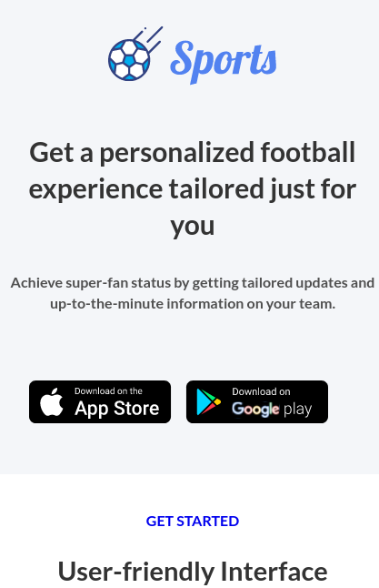
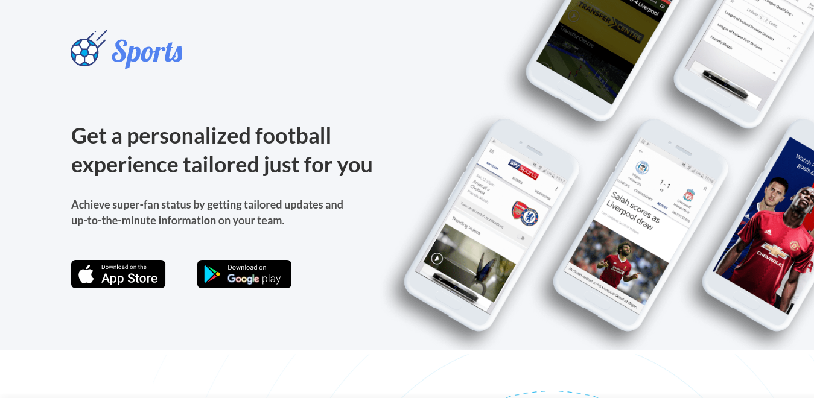

# Source Landing Page

<div align="center">
  <h3>
    <a href="https://github.com/Tanosimboangy/Sport-landing-page">
      Source
    </a>
    <span> | </span>
    <a href="https://jacquit-sport-landing-page.netlify.app/">
      Demo
    </a>
  </h3>
</div>

## **Overview:**



## **Built With:**
- [HTML](https://developer.mozilla.org/en-US/docs/Web/HTML)
- [CSS](https://developer.mozilla.org/en-US/docs/Web/CSS)

## **Figma link:**
You can find the desing online at: [figma desing](https://www.figma.com/file/SC3HqLUP9hGBfn93mIwxkS/Sports-App-homepage-(Responsive%2C-Revised)?node-id=0%3A1)


## **Getting started:**
To clone and run this application, you'll need [Git](https://git-scm.com) and [Node.js](https://nodejs.org/en/download/) (which comes with either [npm](http://npmjs.com) or [yarn](https://yarnpkg.com/)) installed on your computer. From your command line:

```bash
# Clone this repository to your local machine
$ git clone https://github.com/Tanosimboangy/Sport-landing-page.git.

# Install dependencies:
- npm install or yarn install

# Run the app
$ npm start or yarn start
```
